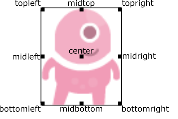
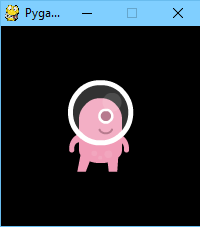
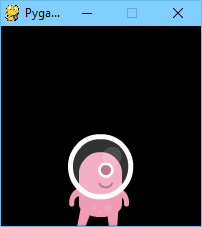
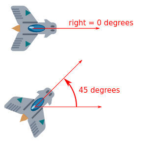

# Установка
## Windows
Запускаем **powershell** с правами администратора:


1. Устанавливаем chocolotey
```sh
Set-ExecutionPolicy Bypass -Scope Process -Force; [System.Net.ServicePointManager]::SecurityProtocol = [System.Net.ServicePointManager]::SecurityProtocol -bor 3072; iex ((New-Object System.Net.WebClient).DownloadString('https://community.chocolatey.org/install.ps1'))
```
2. Устанавливаем vscode 
```sh
choco install vscode
```
3. Устанавливаем python
```sh
choco install python
```
4. Устанавливаем pgzero
```sh
pip install pgzero
```
## MAC OS
1. Устанавливаем **brew**
```sh
/bin/bash -c "$(curl -fsSL https://raw.githubusercontent.com/Homebrew/install/HEAD/install.sh)"
```
2. Устанавливаем vscode 
```py
brew install --cask visual-studio-code
```
3. Устанавливаем python
```sh
brew install python
```
4. Устанавливаем pgzero
```sh
pip3 install pgzero
```
# Hooks

**Hooks** (хуки) - *это функции отвечающие за определенные события. Отрисовка объектов **draw**, обновление объектов на каждом тике update и т.д. В них происходит основная работа при написании игры на **pgzero**.*


## **draw()**

*Вызывается, когда нужно перерисовать экран игры. У функции **draw()** не должно быть аргументов. 
Не рекомендуется вносить изменения в объекты игры внутри функции **draw()**. 
Приведенный ниже блок кода содержит ошибку: не гарантируется, что alien продолжит передвигаться по экрану:*
```py
def draw():
    alien.left += 1
    alien.draw()
```

Правильно разделять обновление состояния объектов и их отрисовку между функциями **draw()** и **update()**
```py 
def draw():
    alien.draw()

def update(dt):
    alien.left += 1
```

## **update(dt)**

*Функция, которая вызывается для обновления состояния игры. Она срабатывает периодически в зависимости от заданного кол-ва FPS. Аргумент dt - количество времени, прошедшее между сменой кадров.
При написании функции update должен обязательно указываться аргумент dt даже если он нигде в теле функции не используется.*
```py
c = 0
def draw():
   screen.fill((0, c, 0))

def update(dt):
   global c, HEIGHT
   c = (c + 1) % 256
   if c == 255:
       HEIGHT += 10
```

## **on_mouse_down(button, pos)**

*Вызывается при нажатии кнопки мышки. Обязательно содержит два аргумента.*
- **pos** – Кортеж (x, y) координаты курсора при нажатии.
- **button** – Номер кнопки мыши, которая была нажата.
```py
def on_mouse_down(button, pos):
   if button == mouse.LEFT:
      alien.pos = pos
```
## **on_mouse_up(button, pos)**

*Вызывается при отпускании кнопки мышки. Обязательно содержит два аргумента.*
- **pos** – Кортеж (x, y) координаты курсора при отпуске.
- **button** – Номер кнопки мыши, которая была отпущена.
```py
def on_mouse_up(button, pos):
   if button == mouse.MIDDLE:
      alien.pos = pos
```

## **on_mouse_move(pos)**

*Вызывается при движении мышки. Обязательно содержит один аргумент.*
- **pos** – Кортеж (x, y) новые координаты курсора.
```py
def on_mouse_move(pos):  
   alien.pos = pos
```
Номера кнопок мышки совпадают с **pygame**:
1. Левая кнопка мыши (**LEFT**)
2. Средняя кнопка мыши (**MIDDLE**)
3. Правая кнопка мыши (**RIGHT**)

## **on_key_down(key)**

*Вызывается при нажатии клавиши клавиатуры.*
- **key** -- Значение нажатой клавиши. См. Таблицу 1.
```py
def on_key_down(key):
   if key == keys.down:
       alien.y += 10
   if key == keys.up:
      alien.y -= 10
```

### **on_key_up(key)**

*Вызывается при отпуске клавиши клавиатуры.*
- **key** -- числовое значение отпущенной клавиши. См. Таблицу 1

# Screen
*Функции отрисовки геометрических фигур на поверхности или экране.*

## **line(start, end, color, width=1)**

*Рисует прямой отрезок от точки начала до точки конца.*
- **start** - Кортеж из двух элементов -- координаты начала отрезка.
- **end** - Кортеж из двух элементов -- координаты конца отрезка.
- **color** - Цвет. см. Подробнее раздел **COLORS**.
- **width** - Толщина линии, необязательный аргумент. По умолчанию 1.
Пример использования:
```py
def draw():
    screen.draw.line((0, 0), (50, 50), "red", 3)
    screen.draw.line((10, 15), (40, 18), "orange")
```

## **circle(pos, radius, color, width=1)**

*Рисует окружность.*
- **pos** - Кортеж из двух элементов -- координаты центра окружности.
- **radius** - Радиус окружности.
- **color** - Цвет. см. Подробнее раздел Color.
- **width** - Толщина линии окружности, необязательный аргумент. По умолчанию 1.
Пример использования:

```py
def draw():
    screen.draw.circle((70, 100), 10, "red", 3)
    screen.draw.circle((50, 50), 5, "orange")
```

## **filled_circle(pos, radius, color)**

*Рисует круг.*
- **pos** - Кортеж из двух элементов -- координаты центра круга.
- **radius** - Радиус круга.
- **color** - Цвет. см. Подробнее раздел Color.
Пример использования:
```py
def draw():
    screen.draw.filled_circle((70, 100), 10, "red")
```

## **polygon(points, color)**

*Рисует многоугольник.*
- **pypoints** - Коллекция пар координат (x, y) вершин многоугольника.
- **color** - Цвет. см. Подробнее раздел Color.
Пример использования:
```py
def draw():
    screen.draw.polygon(((0,0),(100,100), (0,100), (30, 50), (50,60)), color='white')
```

## **filled_polygon(points, color)**

*Рисует многоугольник, залитый цветом.*
- **points** - Коллекция пар координат (x, y) вершин многоугольника.
- **color** - Цвет. см. Подробнее раздел Color.
	Пример использования:

```py
def draw():
    screen.draw.filled_polygon(((0,100), (100, 0), (30, 50), (50,60)), color='orange')
```

## **rect(rect, color, width=1)**

*Рисует ребра прямоугольника.*
- **rect** - Объект класса Rect;
- **color** - Цвет. см. Подробнее раздел Color;
- **width** - толщина линии окружности, необязательный аргумент. по умолчанию 1.
Пример использования:
```py
def draw():
    width, height = 50, 50
    rect = Rect((0, 0), (width, height))
    screen.draw.rect(rect, (10, 10, 10))
```
```py
def draw():
    rect = Rect(50, 50, width, height)
    screen.draw.rect(rect, "red", 5)
```

## **filled_rect(rect, color)**

Рисует прямоугольник.
- **rect** - Объект класса Rect;
- **color** - Цвет. см. Подробнее раздел Color;
- **width** - толщина линии окружности, необязательный аргумент. по умолчанию 1.
Пример использования:
```py
def draw():
    rect = Rect((0, 0), (width, height))
    screen.draw.rect(rect, (10, 10, 10))
```
```py
def draw():
    rect = Rect((50, 50), (width, height))
    screen.draw.rect(rect, "red", 5)
```

# text 
*Используется для отрисовки текста на экране*

**text(text, pos=None, fontname=None, fontsize=None, sysfontname=None,antialias=True, bold=None, italic=None, underline=None, color=None, background=None, top=None, left=None, bottom=None, right=None, topleft=None, bottomleft=None, topright=None, bottomright=None, midtop=None, midleft=None, midbottom=None, midright=None, center=None, centerx=None, centery=None, align=None, anchor=None, surf=None
)**

- **text** - Строка, которую выводим на экран, обязательный аргумент.
- **pos** - Кортеж из двух элементов координаты левого верхнего угла, где - располагается текст.
- **fontname** - Строка, содержит название шрифта.
- **fontsize** -  Число, размер шрифта.
- **antialias** - Сглаженное начертание текста, по-умолчанию True.
- **bold** - Начертание шрифта: жирный. Для использования нужно поставить True.
- **italic** - Начертание шрифта: курсив. Для использования нужно поставить True.
- **underline** - Начертание шрифта: подчеркнутый. Для использования нужно поставить True.
- **color** - Цвет текста, см. подробнее Color.
- **background** - Цвет фона текста, см. подробнее Color.
- **top, left, bottom, centerx, centery** - координаты, задающее расположение определенной границы текста. См. Actor.
- **topleft, bottomleft, topright, bottomright, midtop, midleft, midbottom, midright, center** - Пары координат, задающие расположение текста на экране. См. Actor (4.1).
- **align** -  Заглушка, не использовать.
- **anchor** - Якорь выравнивания текста. См. Actor (4.2).
**surf** - Поверхность, на которой располагается текст.
Примеры использования:
```py
def draw():
    screen.draw.text('Press SPACE to start', 
                 center=(100, 100),     
                 color='white')
```
```py
def draw():
    screen.draw.text('Next level in 3.. 2.. 1..', 
                 midtop=(10, 90), color="white",  
                 background="black")
```

## **set_at(rect_points, color)**

*Рисует точку на экране размером в один пиксель.*
- **rect_points** - Кортеж из двух элементов -- координат точки.
- **color** - Цвет. см. Подробнее раздел Color.
Пример использования:
```py
def draw():
    screen.draw.set_at((15, 15), "#ffffff")
```

# Клавиши
Чтобы узнать какая клавиша нажата на клавиатуре следует использовать **keyboard**.  Если левая стрелка нажата на клавиатуре, то **keyboard.left** будет **True**, иначе будет **False**. Значение **True** сохраняется до тех пор, пока клавишу не отпустят. Регистр атрибута не имеет значения **keyboard.LEFT** == **keyboard.left**

Для большинства клавиш есть свой атрибут. Вот несколько примеров:

**keyboard.a**  #  'A' клавиша
**keyboard.left**  # Клавиша “Левая стрелка” на клавиатуре
**keyboard.k_0**  # 0 в ряде цифр на клавиатуре

Пример использования:
```py
def update(dt):
   # Если клавиша нажата, сдвигать alien 2 пикселя влево на каждом тике
   if keyboard.left:
       alien.x -= 2
   # Если клавиша нажата, сдвигать alien 2 пикселя вправо на каждом тике
   elif keyboard.right:
       alien.x += 2
```

Список основных клавиш можно найти ниже. 
## **Таблица 1. Клавиши.**

| keys           | keyboard       | Название                    |
| -------------- | -------------- | --------------------------- |
| TAB            | tab            | Табуляция                   |
| ENTER          | enter          | Enter(Ввод)                 |
| SPACE          | space          | Пробел                      |
| K_0, K_1 … K_9 | k_0, k_1 … k_9 | Цифры на основной раскладке |
| A, B …. Z      | a, b, … z      | буквы латинской раскладки   |
| UP             | up             | стрелка вверх               |
| DOWN           | down           | стрелка вниз                |
| LEFT           | left           | стрелка влево               |
| RIGHT          | right          | стрелка вправо              |
| LSHIFT         | lshift         | Левый шифт                  |
| RSHIFT         | rshift         | Правый шифт                 |
| RCTRL          | rctrl          | Правый Ctrl                 |
| LCTRL          | lctrl          | Левый Ctrl                  |
| LALT           | lalt           | Левый Alt                   |
| RALT           | ralt           | Правый Alt                  |


Если необходимо обработать однократное нажатие клавиши, без учета ее задержки, нужно использовать переменную keys в **on_key_down**:
```py
def on_key_down(key):
   if key == keys.space:
       alien.top += 10
```

# Actor
Класс **Actor** позволяет удобно оперировать изображениями и их позицией на экране. Любое изображение, перемещающееся по экрану будет экземпляром класса **Actor**. Чтобы создать **Actor** достаточно указать имя файла-изображения(расширение указывать не надо). Простой пример как нарисовать **Actor**:
```py
alien = Actor('alien', (50, 50))
```
```py
def draw():
    screen.clear()
    alien.draw()
```
Для движения **Actor** достаточно изменять атрибуты внутри функции **update()**:
```py
def update():
    if keyboard.left:
        alien.x -= 1
    elif keyboard.right:
        alien.x += 1
```
Можно изменить изображение объекта, изменив атрибут image, указав новое название файла:
```py
alien.image = 'alien_hurt'
```
У **Actors** есть те же методы и атрибуты, что и у **Rect**, включая, например  **colliderect()**, которые могут быть использованы для обработки столкновений двух объектов **Actor**.

## **Расположение Actor**
Можно изменить значение атрибута, отвечающего за расположение Actor, и тогда изменится его позиция на экране. Например:
```py
alien.right = WIDTH
```
Координата правой стороны alien будет равняться **WIDTH**.
Похожим образом можно определить позицию actor в конструкторе, передав одно из ключевых слов: pos, topleft, topright, bottomleft, bottomright, midtop, midleft, midright, midbottom или center:

Оно должно передавать пару координат (x, y). Например:

```py
WIDTH = 200
HEIGHT = 200

alien = Actor('alien', center=(100,100))

def draw():
    screen.clear()
    alien.draw()
```
 


Поменяв **center=(100, 100)** на **midbottom=(100, 200)** получим:



Если при инициализации не было определено месторасположение объекта actor будет расположен *в верхнем левом углу* (что эквивалентно topleft=(0, 0)).

## **Точка “прикрепления”**

Actors имеют “якорную позицию”, которая помогает удобно разместить actor на сцене(экране игры). По умолчанию якорь находится в центре, таким образом .pos атрибут ссылается на центр actor (так же как координаты x и y). Зачастую требуется установить точку якоря в другую часть спрайта(изображения), например в ноги, чтобы легко “поставить” actor на какой-то объект.:

```py
alien = Actor('alien', anchor=('center', 'bottom'))
spaceship = Actor('spaceship', anchor=(10, 50))
```
Якорь определяется кортежем (xanchor, yanchor), в котором значения могут быть числами с плавающей точкой, или строками из строго из набора: left, center/middle, right, top or bottom.


## **Поворот**
Атрибут .angle в  Actor отвечает за поворот спрайта(изображения), в градусах, против часовой стрелки (по часовой стрелке).
Центр поворота -- якорь Actor (См. п 4.2).
Помните, что эта операция изменит ширину и высоту Actor.

Например нужно сделать медленный поворот астероида против часовой стрелки в космосе:
```py
asteroid = Actor('asteroid', center=(300, 300))
def update():
    asteroid.angle += 1
```
 
Чтобы изменить направление поворота на обратное (по часовой стрелке) нужно изменить функцию **update()**:
```py
def update():
    asteroid.angle -= 1
```
Другой пример. Можно сделать так, что **ship** всегда будет смотреть на указатель мышки. Так как **angle_to** возвращает 0 для **right**, спрайт **ship** должен повернуться так:
```py
ship = Actor('ship')

def on_mouse_move(pos):
    ship.angle = ship.angle_to(pos)
```


Помните, что углы имеют период: 0 градусов == 360 градусов == 720 градусов. А еще  -180 градусов == 180 градусов.

## **Расстояние и угол до цели**
У объектов Actor есть удобные функции для вычисления расстояния или угла до других объектов или пары координат (x, y).
```py
actor.distance_to(target)
```
Возвращает расстояние в пикселях от actor до цели target.
```py
actor.angle_to(target)
```
Возвращает угол в градусах от позиции actor до цели target.
Угол будет в диапазоне от -180 до 180 Градусов. Право это 0 градусов и углы возрастают против часовой стрелки.
Таким образом:
Лево это 180 градусов.
Верх это 90 градусов.
Низ это -90 градусов.

# Clock
*Часы позволяют добавлять в игру отложенный вызов функций или вызывать функции через определенный интервал времени.*

```py 
clear()
```

Удалить все функции, связанные с этими часами.
	
Пример использования:
```py 
clock.clear()
```

## **schedule(callback, delay)**

*Однократный запуск функции через указанный интервал времени.*
- **callback** - функция, которую нужно вызвать;
- **delay** - количество секунд, через которое должна быть вызвана функция;
Пример использования:
```py
clock.schedule(my_function_name, 3.0)
```

## **schedule_unique(callback, delay)**

*Однократный запуск функции через указанный интервал времени. Если функция уже в очереди на запуск, её вызов будет отложен.*
- **callback** - функция, которую нужно вызвать;
- **delay** - количество секунд, через которое должна быть вызвана функция;
Пример использования:
```py
clock.schedule_unique(my_function_name, 3.0)
```

## **schedule_interval(callback, delay)**

*Регулярный вызов функции через каждые delay секунд.*
**callback** - функция, которую нужно вызвать;
**delay** - количество секунд, через которое должна быть вызвана функция;
Пример использования:
```py
clock.schedule_interval(my_function_name, 3.0)
```
## **unschedule(callback)**

*Удалить функцию из расписания вызовов.*
- **callback** - функция, которую нужно вызвать;
Пример использования:
```py
clock.unschedule(my_function_name)
```

## **each_tick(callback)**

*Запуск функции на каждый вызов tick()*
- **callback** - функция, которую нужно вызвать;
Пример использования:
```py
clock.each_tick(my_function_name)
```

# Color
*Цвета в pgzero можно представлять тремя способами:*
1. Английское название цвета из списка, можно использовать и заглавные и прописные буквы.
2. Кортеж из трех элементов, соответствующий палитре  RGB.
3. hex кодировка цвета.

Пример цветов:

Название|Строкой|RGB-код|hex|
----|----|----|---|
Белый|white|(255, 255, 255)|#ffffff
Красный|red|(255, 0, 0)|#ff0000
Черный|black|(0, 0, 0)|#000000
Зеленый|green|(0, 255, 0)|#00ff00
Желтый|yellow|(255, 255, 0)|#ffff00
Синий|blue|(0, 0, 255)|#0000ff
Оранжевый|orange|(255, 69, 0)|#ff4500


Примеры с другими способами кодирования цветов:
```py
screen.draw.filled_circle((5, 5), 20, 'black')
screen.draw.filled_circle((30, 40), 20, '#884400')
screen.draw.filled_circle((100,  100), 20, (234, 19, 120))
```

# Animation

Для анимирования большинства вещей можно использовать встроенную функцию animate(). Например, чтобы передвинуть объект Actor из текущей точки в позицию (100, 100) необходимо написать :
```py
animate(alien, pos=(100, 100))
```

## **animate(object, tween='linear', duration=1, **targets)**

*Анимация накладывается на те атрибуты объекта, которые определены в ключевых словах targets.*

- **tween** – Тип анимации параметров, см Таблица 2.
- **duration** – Продолжительность анимации в секундах.
- **targets** – Целевые значения изменяемых атрибутов.
Тип анимации может принимать следующие значения:

|||
|--|--|
linear|Анимация с фиксированной скоростью от начала до конца|
accelerate|Медленный старт, ускорение к концу|
decelerate|Быстрый старт, замедление к концу|
accel_decel|Ускорение к середине и замедление к концу|
end_elastic|Небольшое колебание в конце|
start_elastic|Небольшое колеьание в начале|
both_elastic|Колебания в начале и конце анимации|
bounce_start|Отскок в начале|
bounce_end|Отскок в конце|
bounce_start_end|Отскок в начале и в конце|


Пример использования.
```py
def update(dt):
   if keyboard.space:
       alien.y = GROUND - 50
       animate(alien, y=GROUND, tween='bounce_end', duration=.5)
```
